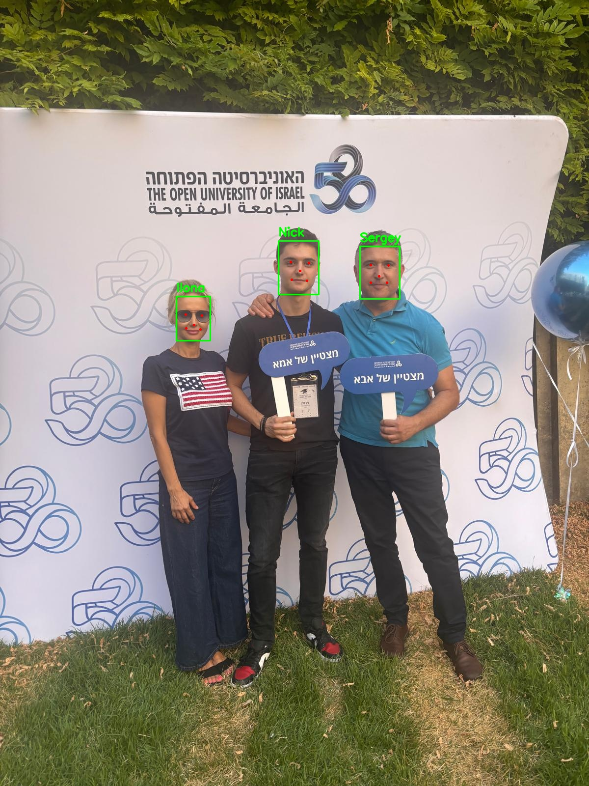

## Introduction
This project is a reimplementation of facial detection and recognition algorithms.
The goal was to recreate and train from scratch:

1.RetinaFace algorithm for face detection  
2.MobileFaceNet CNN using ArcFace loss for facial recognition. 

Both the detection and recognition models are meant to be as light as possible while being accurate, since I need them to run on a raspberry pi zero 2 w. 

## Some Technical Details

1. The original paper on ArcFace loss does not incorporate softmax pre-training. In my expereiments, I have found that
   without it model convergence is not optimal, and slow. that's why i have added softmax pre-training for the first 15 epochs. After that, margin is set to 0.5 like in the paper.
   I have also changed the scale factor in the ArcFace loss function form 64.0 like in the paper to 30.0.

2. The original RetinaFace paper used an anchor placing strategy of 102,300 anchors per image with strides 4, 8, 16, 32, 64 with 3 anchors per feature map location. Since my computing capabilities are
   restricted, I used only 16,800 anchors per image with strides 8, 16, 32 and 2 anchors per feature map location. This still works fine with most faces, altough I assume better performance with the original anchor
   placing strategy. In addition, I used the MobileNetV3Large as a backbone to RetinaFace, pre trained with imagenet weights, as opposed to the ResNet-50 backbone used in the paper. 

## Demo 

